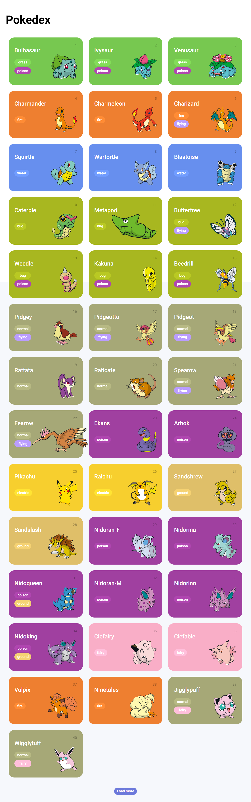

## PokeApi - Listagem de Pokémons
 

    > Projeto desenvolvido com HTML5, CSS3 e JavaScript, onde o mesmo foi usado desde o consumo de uma API REST para a criação de uma Pokédex
    até a manipulação do HTML para automações. 

[Clique aqui para acessar](https://klayvemguimaraes.github.io/PokeApi/pokedex.html)

## 🌍 Tecnologias

- HTML
- CSS
- JAVASCRIPT
- HTTP-SERVER

## 📚 Contato

Gmail : klayvemguik@gmail.com  
LinkedIn : https://www.linkedin.com/in/klayvem-guimar%C3%A3es-5a6700248/